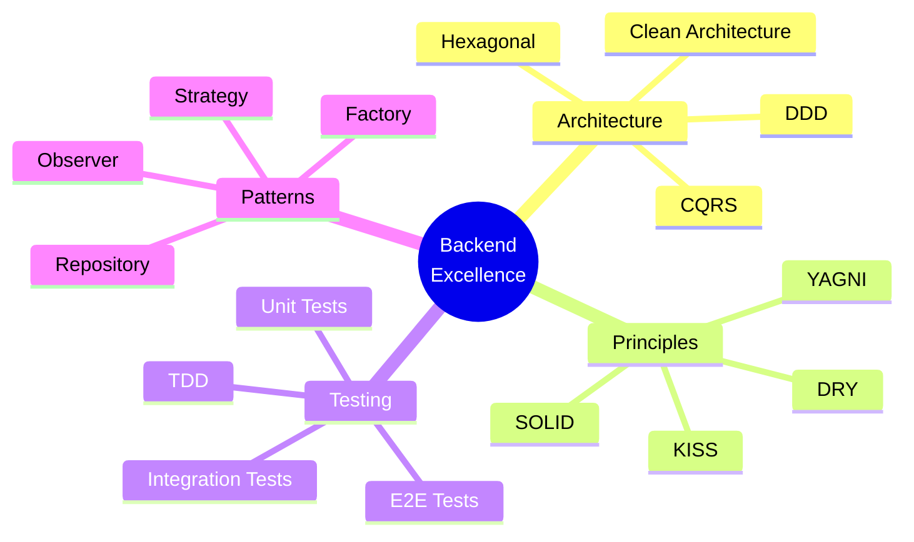

<div align="center">
  
  <!-- Header animado com gradiente -->
  
  
  <!-- Foto de perfil com estilo -->
  
  
  <h3>
    
  </h3>

  <!-- Badges de contato com hover effect -->
  <p>
    <a href="https://www.linkedin.com/in/kariel-martins/" target="_blank">
      
    </a>
    <a href="https://github.com/kariel-martins" target="_blank">
      
    </a>
    <a href="mailto:karielemanoelsilvamartins@gmail.com" target="_blank">
      
    </a>
    <a href="https://portfolio-kariel.vercel.app/" target="_blank">
      
    </a>
    <a href="https://api.whatsapp.com/send?phone=+5599982773482" target="_blank">
      
    </a>
  </p>

  <!-- Contador de visitas -->
  

</div>

<br>

<!-- Sobre mim com ícones -->
## 🚀 Sobre Mim

```typescript
const kariel = {
    role: "Backend Developer",
    location: "Porto Franco, MA - Brasil 🇧🇷",
    currentFocus: ["Microservices Architecture", "Distributed Systems", "High Availability"],
    passions: ["Clean Code", "System Design", "Performance Optimization"],
    learning: ["Event-Driven Architecture"],
    motto: "First make it work, then make it right, then make it fast"
};
```

<table>
  <tr>
    <td>🎯</td>
    <td><b>Foco Atual:</b> Construindo sistemas distribuídos escaláveis com Node.js e TypeScript</td>
  </tr>
  <tr>
    <td>⚡</td>
    <td><b>Superpoder:</b> Transformar requisitos complexos em arquiteturas limpas e testáveis</td>
  </tr>
  <tr>
    <td>🔥</td>
    <td><b>Filosofia:</b> Clean Architecture + TDD = Software à prova de futuro</td>
  </tr>
  <tr>
    <td>📚</td>
    <td><b>Sempre Estudando:</b> Domain-Driven Design, Event Sourcing, CQRS</td>
  </tr>
</table>

<br>

<!-- Tech Stack com melhor organização -->
## 🛠️ Arsenal Tecnológico

<div align="center">

### 💻 Core Stack


### 🎯 Frameworks & Libraries


### 🗄️ Databases & Caching


### 📨 Message Brokers & Queues


### 🐳 DevOps & Infrastructure


### 🧪 Testing & Quality


### 📊 Monitoring & Observability


</div>

<br>

<!-- Padrões e Práticas com visual melhor -->
## 🏗️ Arquitetura & Boas Práticas

<div align="center">



</div>

<table align="center">
  <tr>
    <td align="center" width="200">
      <br>
      <b>Clean Architecture</b><br>
      Separação de responsabilidades
    </td>
    <td align="center" width="200">
      <br>
      <b>TDD</b><br>
      Código confiável e testado
    </td>
    <td align="center" width="200">
      <br>
      <b>RESTful APIs</b><br>
      Interfaces bem definidas
    </td>
    <td align="center" width="200">
      <br>
      <b>DDD</b><br>
      Modelagem de domínio rica
    </td>
  </tr>
</table>

<br>

<!-- Projetos em destaque com melhor visual -->
## 🌟 Projetos em Destaque

<div align="center">

### 🗓️ Smart Agenda API — SaaS Backend Multi-Tenant


<br>

> **Sistema SaaS de agendamentos com arquitetura multi-tenant e foco em escalabilidade horizontal**

<details>
<summary><b>🔍 Ver Características Principais</b></summary>

<br>

- ✅ **Multi-Tenancy**: Isolamento completo de dados por tenant
- ✅ **RBAC**: Sistema robusto de permissões e controle de acesso
- ✅ **Event-Driven**: Arquitetura orientada a eventos com RabbitMQ
- ✅ **Cache Inteligente**: Redis para otimização de performance
- ✅ **Clean Architecture**: Código limpo e manutenível
- ✅ **100% TypeScript**: Type-safety em todo o projeto
- ✅ **Testes Automatizados**: Cobertura superior a 80%
- ✅ **Documentação Swagger**: API completamente documentada

</details>

<br>

<a href="https://github.com/kariel-martins/smart-agenda-api">
  
</a>

<br>

**[📂 Ver Repositório](https://github.com/kariel-martins/smart-agenda-api)** • **[📖 Documentação](https://github.com/kariel-martins/smart-agenda-api#readme)**

</div>

<br>

<!-- Estatísticas com melhor layout -->
## 📊 GitHub Analytics

<div align="center">
  
  
</div>

<div align="center">
  
</div>

<div align="center">
  
</div>

<br>

<!-- Contribuições -->
## 🐍 Contribution Snake

<div align="center">
  
</div>

<br>

<!-- Troféus -->
## 🏆 GitHub Trophies

<div align="center">
  
</div>

<br>

<!-- Quote inspiracional -->
## 💭 Quote do Dia

<div align="center">
  
</div>

<br>

<!-- Seção de contato melhorada -->
## 📬 Vamos Conversar?

<div align="center">

Estou sempre aberto a discutir novos projetos, ideias criativas ou oportunidades de colaboração!

<br>

**Encontre-me em:**

<a href="https://www.linkedin.com/in/kariel-martins/" target="_blank">
  
</a>
<a href="mailto:karielemanoelsilvamartins@gmail.com" target="_blank">
  
</a>
<a href="https://api.whatsapp.com/send?phone=+5599982773482" target="_blank">
  
</a>
<a href="https://portfolio-kariel.vercel.app/" target="_blank">
  
</a>

<br><br>

⭐ **Se você gostou dos meus projetos, deixe uma estrela!** ⭐

</div>

<br>

<!-- Footer animado -->


---

<div align="center">
  <sub>Feito com ❤️ por Kariel Martins</sub>
</div>
